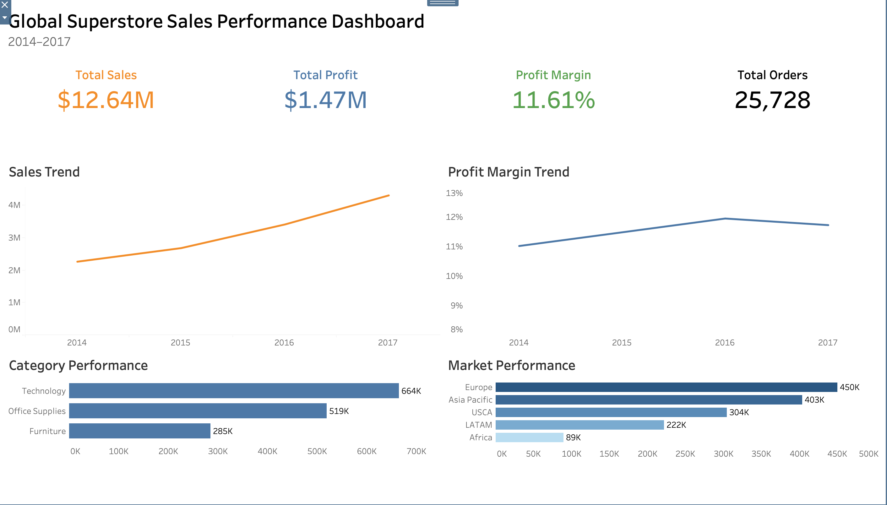

# Global Superstore Profitability Analysis


### Sales Growth vs Profitability:
### Identifying the Root Causes Behind Margin Decline

This project investigates why Global Superstore achieved
continuous sales growth while profit margin failed to improve.

The analysis combines SQL, Python and Tableau to identify
the major drivers behind declining profitability and provide
actionable business recommendations.

---
## Dashboard


🔗 View Interactive Dashboard:
https://public.tableau.com/views/GlobalSuperstoreProfitabilityAnalysis_17847696247550/GlobalSuperstoreSalesPerformanceDashboard?:language=zh-CN&publish=yes&:sid=&:redirect=auth&:display_count=n&:origin=viz_share_link

---
## Business Questions

This project answers the following questions:

- How has business performance changed over time?
- Did sales growth translate into profit growth?
- Which product categories contributed most to declining profitability?
- Which markets generated the greatest losses under high discounts?
- Did aggressive discounting increase return risk?
- What actions should management prioritize?

---
## Key Findings

• Sales increased steadily from 2014 to 2017.

• Profit growth slowed despite higher revenue.

• High-discount transactions generated significantly lower margins.

• Losses were concentrated in several product sub-categories
  including Tables and Bookcases.

• Asia Pacific experienced the largest losses under
  aggressive discounting.

• High-discount orders also showed higher return rates.

---
## Business Recommendations

- Replace blanket discount policies with targeted discount strategies.

- Review pricing for consistently loss-making product categories.

- Strengthen approval rules for high-discount transactions.

- Monitor return rates for heavily discounted orders.

- Prioritize profitability over pure sales growth.

---
## Project Workflow

```text
Business Understanding
        ↓
Data Preparation (SQL)
        ↓
Business Analysis (SQL)
        ↓
Visualization (Python)
        ↓
Interactive Dashboard (Tableau)
        ↓
Business Report (Notion)
        ↓
Business Recommendations
---
## Project Structure

```text
Global Superstore Profitability Analysis
│
├── Dashboard
├── Data_Exports
├── Docs
├── Images
├── Python
├── SQL
└── README.md

---
## Tech Stack

**Database**
- PostgreSQL

**Programming**
- SQL
- Python

**Libraries**
- Pandas
- Matplotlib

**Visualization**
- Tableau Public

**Version Control**
- Git & GitHub
